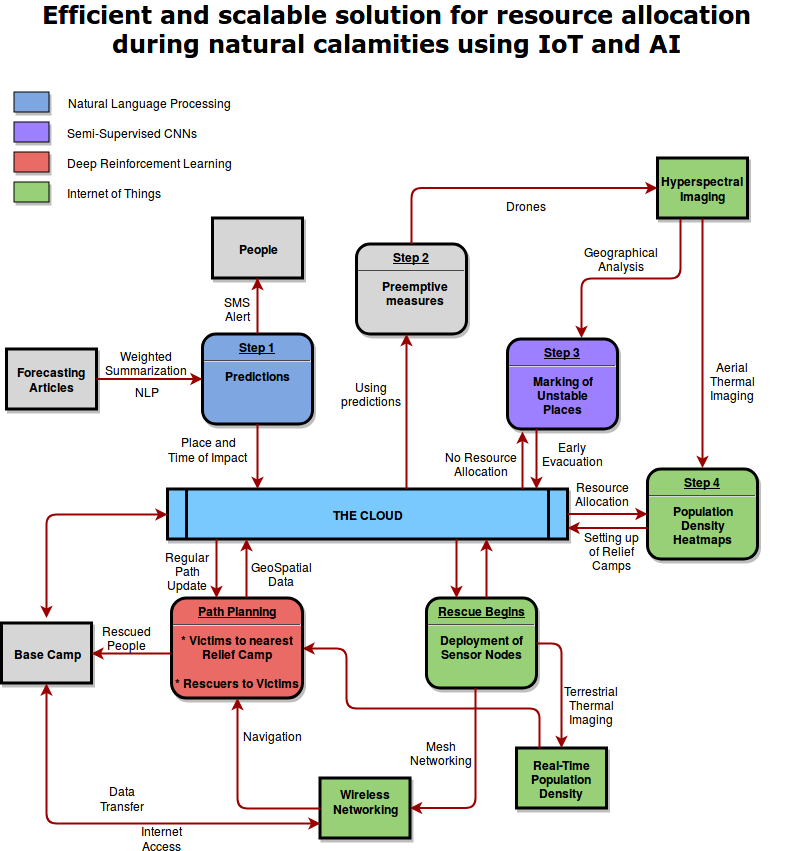

# code.fun.do-yoghurt-cloud

# Process begins:

* Relatively more concrete prediction of *susceptibility* and other details like time and site of impact of the disaster can be done by using several articles from various forecasting agencies and applying *weighted summarization using NLP* on it. 

# Pre-emptive measures: 
*Measures to be taken from the time of confident prediction of the disaster till the moment it strikes. 

* *Thermal imaging* is done using *drones* to identify places with high population density in order to efficiently disseminate the network of relief camps. *Population hotspots* are obtained using *semi-supervised CNNs*.
* *Hyperspectral imaging* for geographic analysis to predict possible chain reactions caused by the aftermath (landslides, etc) and to find places with required geographical integrity to set up camps using *semi-supervised CNNs*. Such places are marked unstable and will be evacuated first.

# Measures during the rescue operation:

* An *IoT* based decentralized network of sensor nodes is deployed throughout the affected region which will have two main objectives, namely, collection of population data using thermal imaging to navigate the rescuers to the victims, and, addressing the network issue. 
* One of the major issues in rescue operations is lack of connectivity with the victims. The deployed sensor nodes can create a *mesh network* to provide wireless connectivity to the entire affected region. The sensor nodes are also continuously deployed manually during the entirety of the rescue operation. 
* The sensor nodes get locations of trapped people and this data is sent to the *cloud*, which then plans a optimal route using *Deep Reinforcement Learning* for the rescue operation to commence. It also directs victims to the nearest feasible relief camp.

# Scalability: 

* *This proposal can be propagated to wide variety of calamities by integrating the sensor nodes with aerial / water based autonomous bots, depending on the feasibility.
